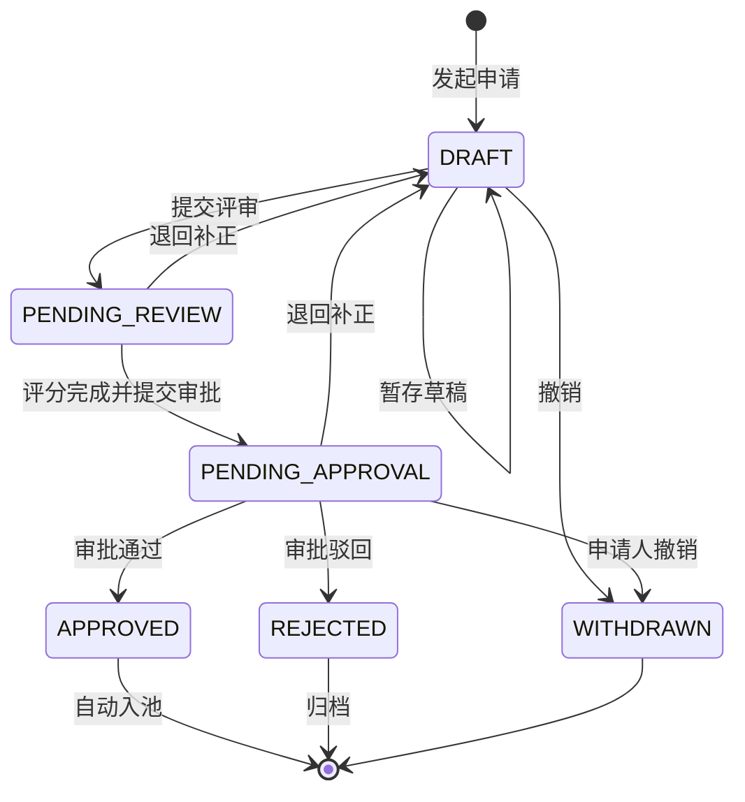
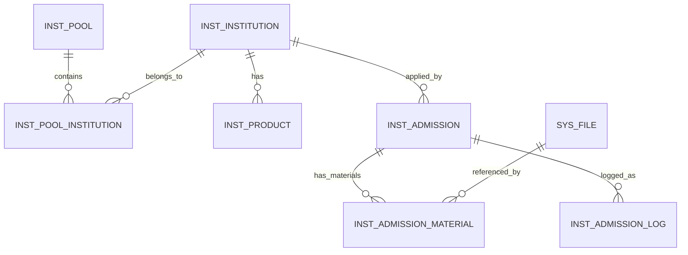

# 合作机构管理中心 - 技术规格说明（第一批）

## Context

### 当前系统架构

系统采用 COLA 分层架构（Spring Boot 3.5 + MyBatis-Plus + PostgreSQL + Redis），前端为 React + TypeScript + Ant Design + Vite。

```
backend-java/
├── project-api/          # API 接口、注解、DTO/Cmd/Query、枚举
├── project-model/        # DO、Mapper 接口、XML 映射
├── project-service/      # Service 实现、Executor（CmdExe/QryExe）、AOP 切面
├── project-web/          # Controller、配置类
└── start/                # 启动入口

frontend/
├── src/components/       # React 组件（Ant Design）
├── src/lib/              # 工具库（apiClient、types、useCrudTable）
└── App.tsx / main.tsx    # 入口
```

### 与本功能高度相关的现有代码

| 文件 | 作用 | 复用方式 |
|------|------|---------|
| [`WorkflowController.java`](../backend-java/project-web/src/main/java/com/zenith/admin/web/WorkflowController.java) | 工作流 Controller（saveDraft/submit/revoke/cancel/resubmit） | **核心复用**：准入流程基于此扩展，新增准入专用流程模板和状态 |
| [`ProcessInstanceDO.java`](../backend-java/project-model/src/main/java/com/zenith/admin/dataobject/ProcessInstanceDO.java) | 流程实例数据模型 | **复用或继承**：准入申请单作为 ProcessInstance 的特化实例 |
| [`ProcessStatusEnum.java`](../backend-java/project-api/src/main/java/com/zenith/admin/enums/ProcessStatusEnum.java) | 流程状态枚举（DRAFT/IN_PROGRESS/PASSED/REVOKED/RETURNED/CANCELLED） | **扩展**：新增准入专属状态（PENDING_REVIEW）或在现有基础上映射 |
| [`FileController.java`](../backend-java/project-web/src/main/java/com/zenith/admin/web/FileController.java) | 文件上传/下载 API | **直接复用**：准入材料上传调用现有文件上传接口 |
| [`FileDO.java`](../backend-java/project-model/src/main/java/com/zenith/admin/dataobject/FileDO.java) | 文件记录模型 | **关联引用**：准入材料通过 file_id 关联到 FileDO |
| [`DataPermission.java`](../backend-java/project-api/src/main/java/com/zenith/admin/annotation/DataPermission.java) | 数据权限注解 | **使用**：机构池查询接口标注 `@DataPermission(strategy = ORG)` |
| [`MyProcess.tsx`](../frontend/src/components/MyProcess.tsx) | 前端「我的流程」组件 | **参考模式**：前端「我的准入申请」页面参照此实现 |
| [`StartProcess.tsx`](../frontend/src/components/StartProcess.tsx) | 前端发起流程组件 | **参考模式**：「发起准入」入口页参照此实现 |
| [`OrgUserManagement.tsx`](../frontend/src/components/OrgUserManagement.tsx) | 组织用户管理组件 | **参考模式**：池内机构列表页参照此表格+搜索模式 |

### 已有工作流系统的能力边界

当前工作流系统提供：
- 流程模板管理（`ProcessTemplate`）：定义审批节点和流转规则
- 流程实例（`ProcessInstance`）：每个申请单的运行时实例
- 任务管理（`Task`）：分配给审批人的待办任务
- 标准操作：草稿保存、提交、撤销、取消、退回、重新提交

**本次准入流程将在此之上构建**：创建一个「管理人准入」专用的流程模板，准入申请单作为该模板的实例运行。评分环节作为流程的一个节点（在提交审批之前）。

## Proposed Changes

### 一、数据库设计

#### 迁移脚本：`database/migration/cooperative_institution.sql`

```sql
-- ============================================================
-- 合作机构管理中心 - 数据库迁移脚本（第一批）
-- 覆盖: 1.1.1 合作机构管理池 + 1.1.2 管理人准入
-- ============================================================

-- 1. 合作机构池表
CREATE TABLE IF NOT EXISTS t_inst_pool (
    id bigserial PRIMARY KEY,
    name varchar(100) NOT NULL,           -- 池名称（唯一）
    pool_type varchar(50) NOT NULL,        -- 池类型（公募池/私募池/专户池等）
    description text,                     -- 描述说明
    owner_id bigint,                      -- 负责人用户ID
    status smallint DEFAULT 1,            -- 状态：1=启用 0=停用
    create_user_id bigint,
    created_time timestamp DEFAULT CURRENT_TIMESTAMP,
    update_user_id bigint,
    update_time timestamp DEFAULT CURRENT_TIMESTAMP,
    UNIQUE(name)
);

COMMENT ON TABLE t_inst_pool IS '合作机构管理池';
CREATE INDEX idx_inst_pool_status ON t_inst_pool(status);
CREATE INDEX idx_inst_pool_type ON t_inst_pool(pool_type);

-- 2. 合作机构表（企业信息主表）
CREATE TABLE IF NOT EXISTS t_inst_institution (
    id bigserial PRIMARY KEY,
    full_name varchar(200) NOT NULL,     -- 机构全称
    short_name varchar(100),             -- 机构简称
    credit_code varchar(18),              -- 统一社会信用代码
    inst_type varchar(50),               -- 机构类型
    establish_date date,                 -- 成立日期
    registered_capital varchar(50),       -- 注册资本
    legal_representative varchar(100),   -- 法定代表人
    registered_address varchar(500),     -- 注册地址
    contact_phone varchar(50),           -- 联系电话
    contact_email varchar(100),          -- 联系邮箱
    logo_url varchar(500),               -- Logo URL
    cooperation_status varchar(20) DEFAULT 'pending', -- 合作状态
    create_user_id bigint,
    created_time timestamp DEFAULT CURRENT_TIMESTAMP,
    update_user_id bigint,
    update_time timestamp DEFAULT CURRENT_TIMESTAMP
);

COMMENT ON TABLE t_inst_institution IS '合作机构（企业信息）';
CREATE INDEX idx_inst_credit_code ON t_inst_institution(credit_code);
CREATE INDEX idx_inst_full_name ON t_inst_institution(full_name);

-- 3. 机构-池关联表（多对多：一个机构可属于多个池）
CREATE TABLE IF NOT EXISTS t_inst_pool_institution (
    id bigserial PRIMARY KEY,
    pool_id bigint NOT NULL REFERENCES t_inst_pool(id),
    institution_id bigint NOT NULL REFERENCES t_inst_institution(id),
    join_date date DEFAULT CURRENT_DATE,   -- 入池日期
    remark text,                          -- 入池备注
    create_user_id bigint,
    created_time timestamp DEFAULT CURRENT_TIMESTAMP,
    UNIQUE(pool_id, institution_id)
);

COMMENT ON TABLE t_inst_pool_institution IS '机构-池关联关系';

-- 4. 合作产品表
CREATE TABLE IF NOT EXISTS t_inst_product (
    id bigserial PRIMARY KEY,
    institution_id bigint NOT NULL REFERENCES t_inst_institution(id),
    product_name varchar(200) NOT NULL,  -- 产品名称
    product_code varchar(50),            -- 产品代码
    product_type varchar(50),            -- 产品类型
    cooperation_status varchar(20) DEFAULT 'cooperating', -- 合作状态
    cooperation_start_date date,         -- 合作起始日期
    end_date date,                       -- 终止日期
    contact_person varchar(100),         -- 产品经理/联系人
    create_user_id bigint,
    created_time timestamp DEFAULT CURRENT_TIMESTAMP,
    update_user_id bigint,
    update_time timestamp DEFAULT CURRENT_TIMESTAMP
);

COMMENT ON TABLE t_inst_product IS '合作产品清单';
CREATE INDEX idx_prod_inst ON t_inst_product(institution_id);
CREATE INDEX idx_prod_status ON t_inst_product(cooperation_status);

-- 5. 准入申请单表（继承工作流概念，独立存储业务数据）
CREATE TABLE IF NOT EXISTS t_inst_admission (
    id bigserial PRIMARY KEY,
    admission_no varchar(30) NOT NULL UNIQUE, -- 申请单号 ADM-YYYYMMDD-NNNN
    process_instance_id bigint,              -- 关联的流程实例ID（可选）
    manager_name varchar(200) NOT NULL,       -- 管理人名称
    manager_type varchar(50) NOT NULL,        -- 管理人类型
    credit_code varchar(18),                  -- 统一社会信用代码
    registered_capital varchar(50),
    establish_date date,
    legal_representative varchar(100),
    registered_address varchar(500),
    contact_person varchar(100) NOT NULL,
    contact_phone varchar(50) NOT NULL,
    contact_email varchar(100),
    target_pool_ids text,                    -- 目标入池ID列表（JSON数组）
    basic_info jsonb,                        -- 完整基本信息（JSON格式冗余存储）
    status varchar(20) DEFAULT 'DRAFT',      -- 申请单状态
    scorer_id bigint,                        -- 评分人ID
    score_result jsonb,                      -- 评分结果（各维度得分+加权总分+评语）
    approver_id bigint,                      -- 最终审批人ID
    approval_opinion text,                   -- 审批意见
    rejection_reason text,                   -- 驳回原因
    create_user_id bigint NOT NULL,          -- 申请人ID
    created_time timestamp DEFAULT CURRENT_TIMESTAMP,
    update_user_id bigint,
    update_time timestamp DEFAULT CURRENT_TIMESTAMP
);

COMMENT ON TABLE t_inst_admission IS '管理人准入申请单';
CREATE INDEX idx_admission_no ON t_inst_admission(admission_no);
CREATE INDEX idx_admission_status ON t_inst_admission(status);
CREATE INDEX idx_admission_creator ON t_inst_admission(create_user_id);

-- 6. 准入申请-材料关联表
CREATE TABLE IF NOT EXISTS t_inst_admission_material (
    id bigserial PRIMARY KEY,
    admission_id bigint NOT NULL REFERENCES t_inst_admission(id),
    material_category varchar(50) NOT NULL,   -- 材料类别（营业执照/金融许可证等）
    material_name varchar(200),              -- 自定义材料名称（自定义补充材料时使用）
    file_id bigint NOT NULL,                 -- 关联文件ID（t_sys_file.id）
    sort_order int DEFAULT 0,                -- 排序序号
    create_user_id bigint,
    created_time timestamp DEFAULT CURRENT_TIMESTAMP
);

COMMENT ON TABLE t_inst_admission_material IS '准入申请-材料关联';
CREATE INDEX idx_am_admission ON t_inst_admission_material(admission_id);
CREATE INDEX idx_am_file ON t_inst_admission_material(file_id);

-- 7. 准入操作日志表
CREATE TABLE IF NOT EXISTS t_inst_admission_log (
    id bigserial PRIMARY KEY,
    admission_id bigint NOT NULL REFERENCES t_inst_admission(id),
    action varchar(50) NOT NULL,             -- 操作类型（CREATE/SUBMIT/SCORE/SUBMIT_APPROVE/APPROVE/REJECT/RETURN/WITHDRAW）
    operator_id bigint NOT NULL,            -- 操作人ID
    operator_name varchar(100),             -- 操作人姓名
    detail text,                            -- 操作详情（JSON格式）
    created_time timestamp DEFAULT CURRENT_TIMESTAMP
);

COMMENT ON TABLE t_inst_admission_log IS '准入操作日志审计';
CREATE INDEX idx_al_admission ON t_inst_admission_log(admission_id);
```

### 二、后端模块变更（子包：`com.zenith.admin.*.inst`）

> **包结构说明**：合作机构管理中心在现有 `com.zenith.admin` 各模块下新增 `inst` 子包，与已有代码共享同一顶层命名空间。

```
com.zenith.admin
├── api.inst/              # project-api 模块
│   ├── dto/
│   │   ├── cmd/     # Cmd 命令对象
│   │   ├── data/    # DTO 数据传输对象
│   │   └── query/   # Query 查询对象
│   └── enums/       # 枚举定义
├── model.inst/            # project-model 模块
│   ├── dataobject/  # DO 数据对象
│   └── mapper/      # Mapper 接口
├── service.inst/          # project-service 模块
│   └── executor/
│       ├── cmd/      # CmdExe 命令执行器
│       └── qry/      # QryExe 查询执行器
└── web.inst/              # project-web 模块
    └── controller/  # Controller 控制器
```

#### 2.1 新增 DO（project-model）— 包路径：`com.zenith.admin.dataobject.inst`

| 文件 | 对应表 | 说明 |
|------|--------|------|
| `InstPoolDO.java` | `t_inst_pool` | 机构池 |
| `InstInstitutionDO.java` | `t_inst_institution` | 合作机构 |
| `InstPoolInstitutionDO.java` | `t_inst_pool_institution` | 机构-池关联 |
| `InstProductDO.java` | `t_inst_product` | 合作产品 |
| `InstAdmissionDO.java` | `t_inst_admission` | 准入申请单 |
| `InstAdmissionMaterialDO.java` | `t_inst_admission_material` | 申请-材料关联 |
| `InstAdmissionLogDO.java` | `t_inst_admission_log` | 操作日志 |

#### 2.2 新增 Mapper 及 XML（project-model）— 包路径：`com.zenith.admin.mapper.inst`

每个 DO 对应一个 Mapper 接口和 XML 文件，遵循现有模式：
- `InstPoolMapper` — 含分页查询、名称唯一性检查
- `InstInstitutionMapper` — 含按信用代码/名称检索、模糊搜索
- `InstPoolInstitutionMapper` — 含按 pool_id 和 institution_id 双向查询
- `InstProductMapper` — 含按 institution_id 查询产品列表
- `InstAdmissionMapper` — 含按状态筛选、按创建人查询（我的申请）、详情
- `InstAdmissionMaterialMapper` — 按 admission_id 查询材料列表
- `InstAdmissionLogMapper` — 追加日志记录

#### 2.3 新增 DTO/Cmd/Query（project-api）— 包路径：`com.zenith.admin.api.inst.dto` / `com.zenith.admin.api.inst.enums`

**Cmd（命令对象）**：

| 文件 | 用途 |
|------|------|
| `InstPoolCreateCmd.java` | 创建机构池（name, type, description） |
| `InstPoolUpdateCmd.java` | 编辑机构池 |
| `InstPoolStatusCmd.java` | 启用/停用机构池 |
| `InstInstitutionCreateCmd.java` | 创建/编辑机构信息 |
| `InstProductCreateCmd.java` | 添加/编辑合作产品 |
| `InstPoolAddInstitutionCmd.java` | 机构入池（poolId, institutionId, remark） |
| `InstAdmissionCreateCmd.java` | 发起准入申请（基本信息字段） |
| `InstAdmissionSubmitCmd.java` | 提交评审（admissionId） |
| `InstAdmissionScoreCmd.java` | 评分提交（各维度分数 + 评语） |
| `InstAdmissionApproveCmd.java` | 审批操作（action: approve/reject/return + opinion） |
| `InstAdmissionMaterialUploadCmd.java` | 关联已上传文件到申请单材料项 |

**Query（查询对象）**：

| 文件 | 用途 |
|------|------|
| `InstPoolPageQuery.java` | 机构池列表查询（name, type, status 分页） |
| `InstitutionPageQuery.java` | 机构列表查询（poolId, keyword 分页） |
| `InstProductPageQuery.java` | 产品列表查询（institutionId, status 分页） |
| `InstAdmissionPageQuery.java` | 准入申请列表查询（status, creatorId 分页） |
| `InstAdmissionDetailQuery.java` | 申请单详情查询（id） |

**DTO（数据传输对象）**：

| 文件 | 用途 |
|------|------|
| `InstPoolDTO.java` | 机构池详情（含机构数量统计） |
| `InstInstitutionDTO.java` | 机构详情（含企业信息 + 产品数 + 所属池） |
| `InstProductDTO.java` | 产品记录 |
| `InstAdmissionDTO.java` | 申请单详情（含基本信息 + 材料列表 + 评分结果） |
| `InstAdmissionMaterialDTO.java` | 材料记录（含文件下载URL） |
| `InstAdmissionScoreDTO.java` | 评分结果（各维度得分 + 加权总分） |
| `InstAdmissionOptionDTO.java` | 下拉选项（池类型、机构类型等枚举值） |

#### 2.4 新增 Service 接口与 Executor（project-service）— 包路径：`com.zenith.admin.service.inst` / `com.zenith.admin.service.inst.executor.{cmd,qry}`

**Service 接口**：

| 接口 | 方法 | 说明 |
|------|------|------|
| `InstPoolService` | CRUD + statusToggle + deleteIfEmpty | 机构池管理 |
| `InstInstitutionService` | CRUD + search + addToPool / removeFromPool | 机构管理 |
| `InstProductService` | CRUD（绑定在机构下） | 产品管理 |
| `InstAdmissionService` | createDraft / submit / score / approve / reject / return / withdraw / getDetail / pageMyApplications | 准入全流程 |
| `InstAdmissionMaterialService` | upload / list / delete | 材料管理 |
| `InstAdmissionLogService` | append | 日志记录 |

**Executor 实现策略**：

遵循项目现有的 CmdExe / QryExe 模式：
- 每个 Cmd 对应一个 `XxxCmdExe`
- 每个 Query 对应一个 `XxxQryExe`
- 评分逻辑封装在 `InstAdmissionScoreCmdExe` 中，包含加权总分计算公式

#### 2.5 新增 Controller（project-web）— 包路径：`com.zenith.admin.web.inst.controller`

| Controller | 路径 | 说明 |
|-----------|------|------|
| `InstPoolController` | `/api/inst/pools` | 机构池 CRUD |
| `InstInstitutionController` | `/api/inst/institutions` | 机构 CRUD + 入池/移出 |
| `InstProductController` | `/api/inst/products` | 产品管理 |
| `InstAdmissionController` | `/api/inst/admissions` | 准入全流程 API |

**关键 API 设计**：

```
POST   /api/inst/pools                        — 创建机构池
PUT    /api/inst/pools/{id}                    — 编辑机构池
POST   /api/inst/pools/{id}/status             — 启用/停用
DELETE /api/inst/pools/{id}                    — 删除空池
GET    /api/inst/pools/page                     — 机构池分页列表
GET    /api/inst/pools/{id}                     — 机构池详情（含机构列表）

GET    /api/inst/institutions/page?poolId=xx    — 池内机构分页列表
GET    /api/inst/institutions/{id}              — 机构详情
POST   /api/inst/institutions                  — 新建机构
PUT    /api/inst/institutions/{id}              — 编辑机构
POST   /api/inst/pools/{poolId}/institutions   — 机构入池
DELETE /api/inst/pools/{poolId}/institutions/{instId} — 机构移出

GET    /api/inst/products?page&institutionId=xx — 产品列表
POST   /api/inst/products                      — 添加产品
PUT    /api/inst/products/{id}                 — 编辑产品
DELETE /api/inst/products/{id}                 — 删除产品

POST   /api/inst/admissions/draft              — 创建草稿
PUT    /api/inst/admissions/draft/{id}         — 更新草稿
POST   /api/inst/admissions/{id}/submit        — 提交评审
POST   /api/inst/admissions/{id}/score         — 提交评分
POST   /api/inst/admissions/{id}/approve       — 审批操作（通过/驳回/退回）
POST   /api/inst/admissions/{id}/withdraw      — 撤销申请
GET    /api/inst/admissions/my                 — 我的申请列表
GET    /api/inst/admissions/{id}               — 申请单详情
POST   /api/inst/admissions/{id}/materials     — 上传/关联材料
GET    /api/inst/admissions/{id}/materials     — 材料列表
DELETE /api/inst/admissions/materials/{matId}  — 删除材料
```

#### 2.6 枚举与常量（project-api）— 包路径：`com.zenith.admin.api.inst.enums`

| 枚举 | 值 | 说明 |
|------|-----|------|
| `InstPoolTypeEnum` | PUBLIC_FUND / PRIVATE_FUND / SPECIAL_ACCOUNT / OTHER | 池类型 |
| `InstTypeEnum` | FUND_COMPANY / ASSET_MANAGER / SECURITIES / INSURANCE / BANK_WEALTH / OTHER | 机构类型 |
| `InstProductTypeEnum` | PUBLIC_FUND / SPECIAL_ACCOUNT / PRIVATE_PRODUCT / OTHER | 产品类型 |
| `InstCooperationStatusEnum` | COOPERATING / TERMINATED / SUSPENDED / PENDING_ADMIT | 合作状态 |
| `InstAdmissionStatusEnum` | DRAFT / PENDING_REVIEW / PENDING_APPROVAL / APPROVED / REJECTED / WITHDRAWN | 准入申请状态 |
| `InstAdmissionActionEnum` | CREATE / SUBMIT / SCORE / SUBMIT_APPROVE / APPROVE / REJECT / RETURN / WITHDRAW | 操作类型 |
| `InstMaterialCategoryEnum` | BUSINESS_LICENSE / FINANCIAL_LICENSE / FINANCIAL_REPORT / ARTICLES / QUALIFICATION_CERT / INTERNAL_CONTROL / OTHER | 材料类别 |

### 三、评分引擎设计

评分采用**固定权重简化版**（完整多模板体系在 1.1.4 批次实现），权重配置如下：

| 维度 | 权重 | 满分 |
|------|------|------|
| 公司综合实力 | 20% | 100 |
| 合规与风控 | 25% | 100 |
| 投研能力 | 25% | 100 |
| 服务能力 | 15% | 100 |
| 扣分项 | 15% | 100（负向，0=无扣分） |

**加权总分计算公式**：
```
totalScore = Σ(dimensionScore[i] × weight[i] / 100)

其中扣分项维度特殊处理：
  effectiveDeductionScore = max(0, 100 - deductionScore)  // 先转为正向
  deductionContribution = effectiveDeductionScore × 15%      // 再乘权重
```

**准入分数线**：默认 60 分，可通过配置调整（后续批次支持按池类型差异化配置）。

### 四、前端模块变更

#### 4.1 新增页面/组件

| 组件文件 | 路由 | 说明 |
|---------|------|------|
| `InstPoolList.tsx` | `/inst/pools` | 机构池管理主页（卡片/列表视图） |
| `InstPoolForm.tsx` | 弹窗 | 新建/编辑机构池表单 |
| `InstPoolDetail.tsx` | `/inst/pools/:id` | 机构池详情（含机构列表 Tab） |
| `InstitutionList.tsx` | 内嵌于 PoolDetail | 池内机构列表（带搜索、入池/移出操作） |
| `InstitutionForm.tsx` | 弹窗 | 新建/编辑机构信息表单 |
| `InstitutionDetail.tsx` | `/inst/institutions/:id` | 机构详情页（企业信息 Tab + 产品清单 Tab） |
| `ProductForm.tsx` | 弹窗 | 添加/编辑产品表单 |
| `AdmissionCreate.tsx` | `/inst/admissions/create` | 发起准入申请（基本信息 + 材料上传） |
| `AdmissionEdit.tsx` | `/inst/admissions/edit/:id` | 编辑草稿 |
| `AdmissionDetail.tsx` | `/inst/admissions/:id` | 申请单详情（只读/评分/审批 视角切换） |
| `AdmissionScore.tsx` | 内嵌于 Detail 或独立页 | 评分界面 |
| `AdmissionMyList.tsx` | `/inst/admissions/my` | 我的准入申请列表 |
| `MaterialUploader.tsx` | 组件 | 材料上传组件（复用 FileTable 的上传能力） |

#### 4.2 前端技术要点

- 所有列表页遵循 [前端分页规范](../.trae/rules/frontend-pagination-spec.md)：标准 pagination 配置、搜索归页
- 所有通知遵循 [前端通知规范](../.trae/rules/frontend-notification-spec.md)：使用 Notification 组件，禁止 alert/confirm
- 使用已有的 `useCrudTable` hook 封装列表 CRUD 逻辑
- 使用已有的 `apiClient` 进行 HTTP 请求
- 材料上传复用已有 `FileTable` 的上传模式，调用 `/api/files/upload` 接口

### 五、数据权限集成

| 接口 | 注解策略 | 说明 |
|------|---------|------|
| 机构池列表 | `@DataPermission(strategy = ORG)` | 用户仅可见所属组织及下级组织的机构池 |
| 机构列表（池内） | `@DataPermissionIgnore` | 已限定在指定池内，无需额外过滤 |
| 准入申请列表（我的） | `@DataPermissionIgnore` | 仅查看自己的申请 |
| 待评分列表 | `@DataPermission(strategy = ORG)` | 评分人仅处理本组织范围内的申请 |
| 待审批列表 | `@DataPermission(strategy = ORG)` | 审批人仅处理本组织范围内的申请 |

## Diagram

### 准入流程状态机



### 数据关系 ER 图（核心实体）



## Testing and Validation

### 单元测试

| 测试类 | 验证的 PRODUCT.md 不变量 |
|--------|--------------------------|
| `InstPoolServiceTest` | #6-9（机构池 CRUD + 启用停用 + 删除约束） |
| `InstInstitutionServiceTest` | #19-20（入池/移出 + 多对多关系） |
| `InstAdmissionServiceTest` | #24（状态机流转合法性）、#33（零材料提交）、#40（低于准入线警告） |
| `InstAdmissionScoreTest` | #36-38（加权总分计算正确性） |
| `InstAdmissionMaterialServiceTest` | #29-32（材料上传/替换/删除） |

### 集成测试场景

| 场景 | 步骤 | 预期结果 | 对应不变量 |
|------|------|---------|-----------|
| **完整准入流程** | 发起→填写→上传材料→提交→评分→审批通过 | 机构自动入池 | #21-49 |
| **零材料准入** | 仅填基本信息→不传材料→提交→评分→通过 | 正常通过 | #33 |
| **评分低于准入线** | 评分为 45 分 → 提交审批 | 弹出确认警告 | #40 |
| **退回补正** | 评分人退回 → 申请人收到通知 → 补充后重新提交 | 回到 DRAFT | #41 |
| **驳回** | 审批人驳回 → 申请人收到含原因的通知 | 变为 REJECTED | #45-46, #50 |
| **机构多池归属** | 机构 A 加入池 X → 再加入池 Y | A 同时在 X 和 Y 中 | #19 |
| **空池删除** | 空 Z 池 → 删除 | 成功；非空池删除被拒 | #9 |
| **停用池保护** | 停用池 P → 尝试添加机构 | 操作被拒绝 | #7 |
| **我的申请列表** | 用户 U 发起 3 个申请 → 查看「我的申请」 | 显示 3 条记录 | #51-54 |
| **并发审批冲突** | 两人同时审批同一申请 | 以最后提交为准 | PRODUCT.md #44 |

### 手动验证步骤

1. 执行 `database/migration/cooperative_institution.sql`
2. 启动应用，确认无启动报错
3. 通过 Swagger 测试所有 API 端点
4. 验证文件上传 → 材料关联 → 在线预览链路
5. 验证移动端浏览器访问适配性

## Parallelization

### 可并行的工作项

```
Step 1 (DB migration) ──────────────────────────────┐
                                                   ├──→ Step 2a (机构池后端: DO/Mapper/Service/Controller)
Step 2b (机构+产品后端: DO/Mapper/Service/Controller) ┤
                                                   ├──→ Step 2c (准入后端: DO/Mapper/Service/Controller + 评分引擎)
                                                   │
Step 3 (前端: 机构池页面) ──────────────────────────┤
Step 4 (前端: 准入流程页面) ─────────────────────────┤
                                                   │
Step 5 (单元测试 + 集成测试) ←───────────────────────┘
```

**建议并行分组**：

| Agent | 工作内容 | 依赖 | 预计工作量 |
|-------|---------|------|-----------|
| **Agent-A: 机构池后端** | InstPool 全套（DO/Mapper/Service/Controller/DTO） | Step 1 DB | 大 |
| **Agent-B: 机构+产品后端** | Institution + Product 全套 + 机构-池关联逻辑 | Step 1 DB | 大 |
| **Agent-C: 准入后端** | Admission 全套 + Material + Log + 评分引擎 | Step 1 DB | 最大 |
| **Agent-D: 前端** | 机构池页面 + 准入流程页面 + 公共组件 | Agent-A/B/C 的 API 定义 | 最大 |

Agent-D 可以在 API 定义（DTO/Cmd/Query）确定后就开始开发前端，不必等待后端完全实现。

**结论**：由于 4 个 Agent 之间有明确的数据模型依赖（共享数据库 schema 和 DTO 定义），建议 **Agent-A/B/C 并行开发后端**，**Agent-D 稍滞后但可在 API 契约确定后开始前端开发**。

## Risks and Mitigations

| 风险 | 影响 | 概率 | 缓解措施 |
|------|------|------|---------|
| 准入流程与现有工作流系统耦合过深 | 后续升级困难 | 中 | 准入申请单保持独立表（t_inst_admission），process_instance_id 为可选外键，解耦核心业务数据 |
| 文件存储本地磁盘导致容量问题 | 生产环境不可用 | 低 | 本批次先用本地存储；后续对接 MinIO/OSS 时仅需修改 FileController 存储路径 |
| 评分公式后期需大幅调整 | 重构成本 | 低 | 将评分计算抽取为独立的 `ScoringEngine` 类，权重和公式参数化 |
| 前端页面较多，开发周期长 | 交付延迟 | 高 | 分两批交付 UI：首批做机构池 + 准入申请/列表，第二批做详情页 + 评分页 + 审批页 |
| 移动端适配遗漏 | 移动端体验差 | 中 | 使用 Ant Design 的响应式栅格系统；关键操作按钮确保 44px 最小触摸区域 |
| 申请单号生成在高并发下重复 | 数据异常 | 低 | 采用数据库序列或 Redis 原子递增保证唯一性 |

## Follow-ups

1. **1.1.3 管理人协议管理**：协议线上化归档、分类管理、版本控制
2. **1.1.4 尽职调查与质量分析评分**：多模板差异化的完整评分体系（指数增强类/绝对收益类/高波类/历史兼容）
3. **1.1.5 扩展信息管理**：尽调流程中的扩展记录、报告状态联动、映射关系维护
4. **1.1.6 过期与调出池管理**：过期统计、批量调出、条件筛选
5. **OA 系统实际对接**：本批次预留 ApprovalService 接口，后续接入具体 OA 系统
6. **文件存储升级**：从本地文件系统迁移至对象存储（MinIO/OSS）
7. **消息通知增强**：从站内消息扩展到邮件、短信等多渠道通知
